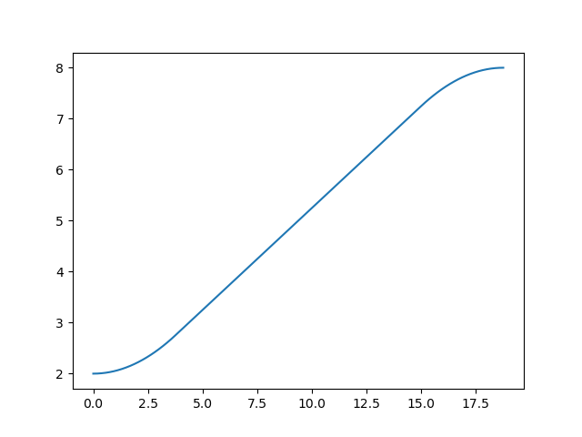
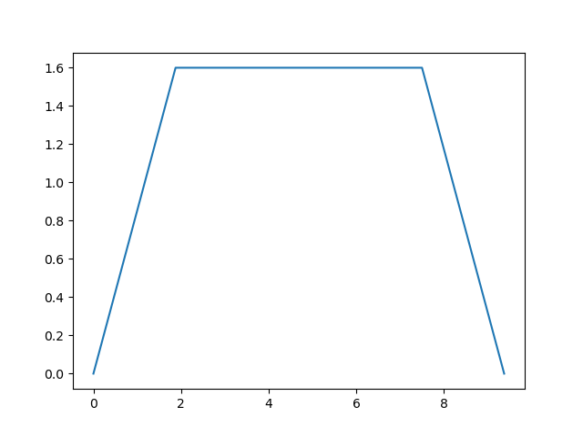

# Trajectory-Plot
It provides useful graph plots to obtain trapezoidal motion profile using python matplotlib.

**Authors: Mehmet KAHRAMAN / Date: 05.09.2024**

Requirements:
---
- Python3
- Numpy
- Matplotlib

Run trajectory plot:
---
```
python3 trapezoidal_plot.py
```

Images:
---


